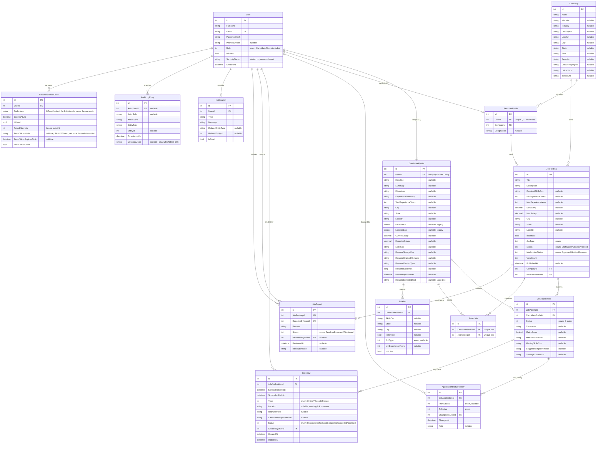

# Database Design

## Table of Contents
- [Entity-Relationship Diagram](#entity-relationship-diagram)
- [Table Descriptions](#table-descriptions)
- [Relationships, Keys, and Constraints](#relationships-keys-and-constraints)
- [Enums Stored as Integers](#enums-stored-as-integers)
- [Data Lifecycle](#data-lifecycle)
- [Seed Data Strategy](#seed-data-strategy)
- [Migration History](#migration-history)

All tables map 1:1 to entities in `src/AIRecruiter.Domain/Entities/`, configured in `src/AIRecruiter.Infrastructure/Persistence/AppDbContext.cs`. Every entity inherits `BaseEntity` (`Id` int PK identity, `CreatedAt` UTC datetime, nullable `UpdatedAt`).

## Entity-Relationship Diagram

## Table Descriptions

| Table | Purpose |
|---|---|
| `Users` | One row per account, any role. `Email` is unique (case-normalized at write time in `AuthService`). Passwords are stored only as a BCrypt hash. |
| `CandidateProfiles` | 1:1 extension of a `User` with `Role=Candidate` — created lazily (auto-created empty) on first profile access, not at registration time. |
| `RecruiterProfiles` | 1:1 extension of a `User` with `Role=Recruiter`, created during company onboarding, links to exactly one `Company`. |
| `Companies` | One row per employer. Multiple recruiters can belong to the same company (`RecruiterProfiles.CompanyId`). |
| `JobPostings` | The core listing entity — India-structured location, lifecycle `Status`, separate `ModerationStatus`, and a `ViewCount` counter. |
| `JobApplications` | One row per (candidate, job) pair — enforced unique. Carries the resume-match snapshot computed at apply time. |
| `ApplicationStatusHistories` | Append-only audit trail of every status transition on an application, including who changed it and an optional candidate-visible note. |
| `Interviews` | A single proposed start/end time per row (not a list of candidate-selectable slots) — a recruiter proposes/reschedules, a candidate accepts or declines. |
| `SavedJobs` | Candidate bookmarks — unique per (candidate, job). |
| `JobAlerts` | Candidate-defined match criteria; `IsActive` allows pausing without deleting. Matches are computed live, not stored. |
| `JobReports` | A flagged job, reviewed by an Admin. |
| `Notifications` | In-app notification feed per user. |
| `AuditLogEntries` | Append-only, platform-wide action log. `MetadataJson` is deliberately restricted to small, non-sensitive payloads (see [SECURITY_AND_AUTH.md](SECURITY_AND_AUTH.md)). |
| `PasswordResetCodes` | One row per forgot-password attempt — a hashed 6-digit code, and (once verified) a hashed reset token. Never stores the raw code, the raw token, or the new password. See [SECURITY_AND_AUTH.md § Password Reset Flow](SECURITY_AND_AUTH.md#password-reset-flow). |

## Relationships, Keys, and Constraints

All foreign keys and delete behaviors are configured explicitly in `AppDbContext.OnModelCreating`:

| Relationship | Delete behavior | Why |
|---|---|---|
| `User → CandidateProfile` / `User → RecruiterProfile` | Cascade | Deleting a user removes their profile |
| `RecruiterProfile → Company` | Restrict | A company can't be deleted while recruiters still reference it |
| `JobPosting → Company`, `JobPosting → RecruiterProfile` | Restrict | Preserve job history even if a recruiter/company record needs cleanup |
| `JobApplication → JobPosting`, `JobApplication → CandidateProfile` | Cascade | Applications are meaningless without their job/candidate |
| `ApplicationStatusHistory → JobApplication` | Cascade | History is owned by the application |
| `ApplicationStatusHistory → ChangedByUser` | Restrict | Don't lose history if the acting user is later removed |
| `Interview → JobApplication` | Cascade | |
| `Interview → CreatedByUser` | Restrict | |
| `SavedJob → CandidateProfile`, `SavedJob → JobPosting` | Cascade | |
| `JobAlert → CandidateProfile` | Cascade | |
| `JobReport → JobPosting` | Cascade | |
| `JobReport → ReportedByUser`, `JobReport → ReviewedByUser` | Restrict | |
| `Notification → User` | Cascade | |
| `AuditLogEntry → ActorUser` | Restrict | Audit history must survive even if the actor account is later removed |
| `PasswordResetCode → User` | Cascade | A user's reset attempts are meaningless without the user |

**Unique indexes** (the two constraints that matter most for correctness):
- `Users(Email)` — unique, prevents duplicate accounts.
- `JobApplications(JobPostingId, CandidateProfileId)` — unique, the database-level backstop against a duplicate application (the service also pre-checks, but this index is what actually prevents a race condition from creating two rows).
- `SavedJobs(CandidateProfileId, JobPostingId)` — unique, same pattern for duplicate saves.

**Decimal precision**: every `decimal`/`decimal?` property across all entities is configured to `precision(18, 2)` in a single loop at the end of `OnModelCreating` — covers salary and match-score fields without repeating the configuration per entity.

## Enums Stored as Integers

Every enum (`UserRole`, `JobStatus`, `JobType`, `ModerationStatus`, `ApplicationStatus`, `InterviewStatus`, `InterviewType`, `ReportStatus`) is persisted as its `int` value by EF Core's default conversion — see [API_REFERENCE.md § Enum Reference](API_REFERENCE.md#enum-reference) for the exact mapping. DTOs returned to the frontend convert these to their string names (`j.Status.ToString()`); requests sent to the API still use the numeric wire value, translated by small `Record<string, number>` maps in the frontend API clients (e.g. `jobTypeToNumber`, `applicationStatusToNumber`).

## Data Lifecycle

1. **Registration** → a `Users` row is created (`AuthService.RegisterAsync`); no profile row yet. An `AuditLogEntry` (`"UserRegistered"`) is written.
2. **Profile creation** → happens lazily: a candidate's first `GET/PUT /api/candidates/me` call creates an empty `CandidateProfiles` row if none exists; a recruiter's first onboarding submission creates both `Companies` and `RecruiterProfiles` rows.
3. **Job creation/publishing** → `JobPostings` row created with `Status=Draft` or `Status=Open` (+`PublishedAt`) depending on `saveAsDraft`. Status transitions thereafter are validated against an explicit allowed-transition table (see [SYSTEM_DESIGN.md](SYSTEM_DESIGN.md)).
4. **Application** → a `JobApplications` row is inserted alongside an initial `ApplicationStatusHistories` row (`FromStatus=null, ToStatus=Applied`). Every subsequent recruiter status change or candidate withdrawal appends another history row rather than mutating history in place — the full timeline is always reconstructible.
5. **Interview** → a recruiter proposes a single `Interviews` row (`Status=Proposed`) for the application; the candidate accepts (`Status=Scheduled`) or declines (`Status=Declined`); a recruiter can reschedule (`Status` reverts to `Proposed`, requiring re-acceptance), cancel, or mark it completed once its time has passed.
6. **Retention / deletion**: there is currently **no** scheduled retention/deletion job or "right to be forgotten" endpoint — all data persists indefinitely once created. `AuditLogEntries` are explicitly designed to survive even if the actor `User` row is later deleted (`Restrict` delete behavior, nullable `ActorUserId`). This is a known limitation for a real production deployment handling personal data (see [SECURITY_AND_AUTH.md § Known Limitations](SECURITY_AND_AUTH.md#known-limitations-and-production-hardening)).

## Seed Data Strategy

`DataSeeder.SeedAsync` runs **only when `app.Environment.IsDevelopment()`** (checked in `Program.cs`, not inside the seeder itself). It is idempotent by checking for one known seed user (`recruiter1@demo.airecruiter.dev`) before doing anything — safe to restart the API repeatedly without duplicating data. It seeds:

- 1 Admin, 6 Recruiters (one per seeded company), 8 Candidates — all seeded users share the password `Demo@123` (BCrypt-hashed, not stored in plaintext anywhere).
- 6 companies across 6 different Indian cities.
- A spread of jobs across `JobStatus` and `ModerationStatus` values, and applications across most `ApplicationStatus` values (including a `Withdrawn` example), so every dashboard/analytics view has non-trivial data to render out of the box.

This never runs outside `Development`, so it is a no-op in any real deployment — see [SETUP_AND_DEMO.md](SETUP_AND_DEMO.md) for the exact seeded account table and how to reset seed data.

## Migration History

Seven EF Core migrations exist under `src/AIRecruiter.Infrastructure/Persistence/Migrations/`, applied in order:

1. **`InitialCreate`** — core schema: Users, CandidateProfiles, RecruiterProfiles, Companies, JobPostings, JobApplications.
2. **`AddOnboardingProfilesApplicationsResumeMatching`** — candidate profile enrichment fields, resume metadata columns, application match-score fields.
3. **`AddJobPostingViewCount`** — adds `JobPostings.ViewCount`.
4. **`AddIndiaPlatformUpgrade`** — the largest migration: India-structured location columns on `JobPostings`/`CandidateProfiles`, expanded `Companies` fields, and 7 new tables (`ApplicationStatusHistories`, `AuditLogEntries`, `Interviews`, `InterviewSlots`, `JobAlerts`, `JobReports`, `Notifications`, `SavedJobs`) plus their indexes. (The original `Interviews`/`InterviewSlots` shape from this migration was later replaced — see migration 7.)
5. **`AddJobLifecycleAlertsAndCandidateSearch`** — adds `JobPostings.PublishedAt` and `JobAlerts.IsActive`. (Candidate search/CSV export needed no schema change — it only reads existing tables; view-count de-duplication is deliberately in-memory, not a new table.)
6. **`AddPasswordResetAndSecurityStamp`** — adds `Users.SecurityStamp` (backfilled with a distinct random value per existing user via a raw SQL statement in the migration, rather than leaving every pre-existing account sharing the column's default) and the new `PasswordResetCodes` table.
7. **`RedesignInterviewScheduling`** — drops the `InterviewSlots` table and reshapes `Interviews` from a multi-slot proposal model to a single proposed start/end time per row (adds `ScheduledStartUtc`, `ScheduledEndUtc`, `Type`, renames `DeclineNote`→`RecruiterNote`, adds `CandidateResponseNote`); adds the `Declined` interview status.
