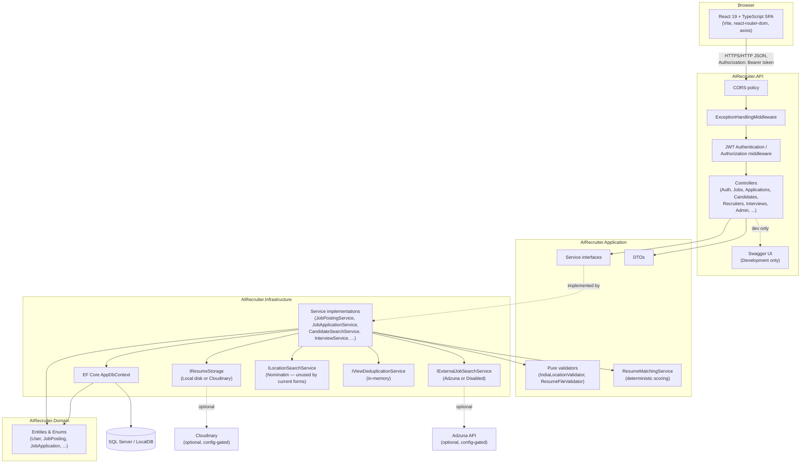
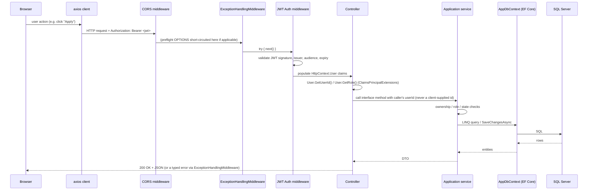
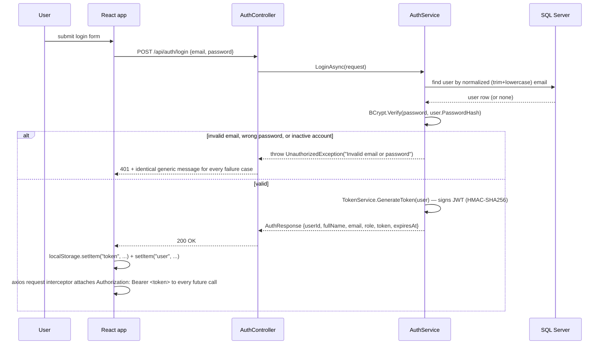
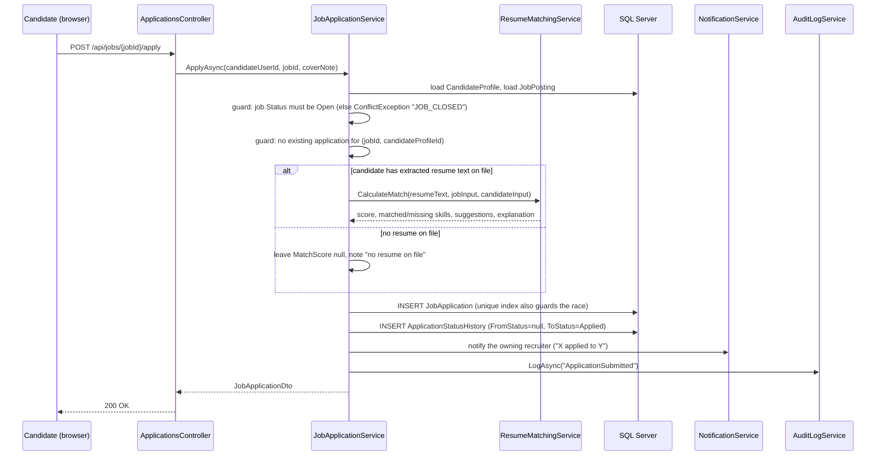
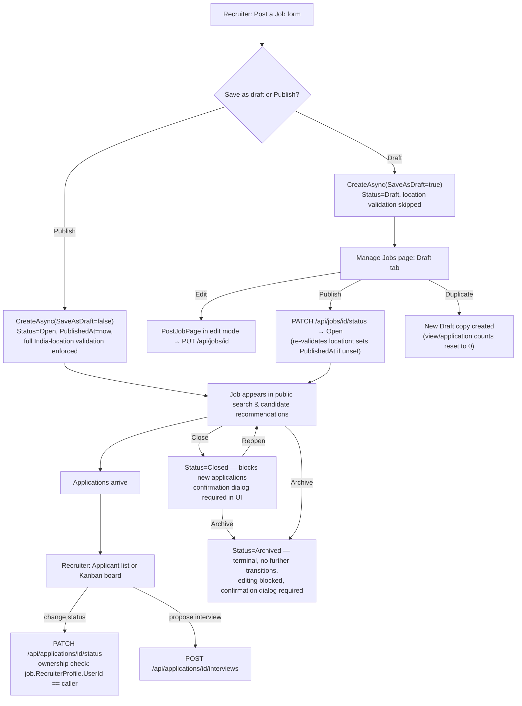
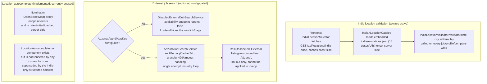

# System Design

## Table of Contents
- [High-Level Architecture](#high-level-architecture)
- [Clean Architecture Layers](#clean-architecture-layers)
- [Dependency Injection](#dependency-injection)
- [Request Flow](#request-flow)
- [Authentication Flow](#authentication-flow)
- [Candidate Application Flow](#candidate-application-flow)
- [Recruiter Job Publishing & Applicant Management Flow](#recruiter-job-publishing--applicant-management-flow)
- [Resume Upload & Matching Flow](#resume-upload--matching-flow)
- [External Job Search & Location Integration](#external-job-search--location-integration)
- [Role-Based Access and Ownership Rules](#role-based-access-and-ownership-rules)
- [Frontend Architecture](#frontend-architecture)
- [CORS and Local HTTP/HTTPS Configuration](#cors-and-local-httphttps-configuration)
- [Cross-Cutting Concerns](#cross-cutting-concerns)
- [Production Scalability Discussion](#production-scalability-discussion)

## High-Level Architecture



## Clean Architecture Layers

| Layer | Project | Responsibility | Depends on |
|---|---|---|---|
| Domain | `AIRecruiter.Domain` | Entities (`User`, `JobPosting`, `JobApplication`, …) and enums (`JobStatus`, `ApplicationStatus`, …). No framework references. | Nothing |
| Application | `AIRecruiter.Application` | DTOs, service **interfaces**, and framework-free business logic that can be unit tested without a database — `IndiaLocationValidator`, `ResumeFileValidator`, `ResumeMatchingService`, the `IndiaLocationFormatter` display helper. | Domain |
| Infrastructure | `AIRecruiter.Infrastructure` | Concrete service implementations, `AppDbContext` and migrations, external integrations (Cloudinary, Adzuna, Nominatim), local resume storage, the in-memory view-dedup cache, `TokenService` (JWT creation). | Application, Domain |
| API | `AIRecruiter.API` | ASP.NET Core controllers (thin — they extract the caller's identity from the JWT and call an injected service interface), `Program.cs` composition root, `ExceptionHandlingMiddleware`, `ClaimsPrincipalExtensions`. | Infrastructure, Application, Domain |

**Dependency direction** always points inward: API → Infrastructure → Application → Domain. Controllers only depend on `Application` interfaces (e.g. `IJobPostingService`), never on `Infrastructure` concrete classes directly — the concrete implementation is resolved at runtime by the DI container. This means the Application layer's business rules (state-machine transitions, ownership checks inside services, validation) have no compile-time dependency on EF Core or ASP.NET Core, and could theoretically be tested or reused without either.

## Dependency Injection

Two composition methods wire everything together, both called from `Program.cs`:

- `AddApplicationServices()` (`AIRecruiter.Application/DependencyInjection.cs`) registers the framework-free singletons: `IResumeMatchingService`, `ResumeFileValidator`, `IndiaLocationValidator`.
- `AddInfrastructure(configuration)` (`AIRecruiter.Infrastructure/DependencyInjection.cs`) registers `AppDbContext` (SQL Server), every scoped service (`IAuthService`, `IJobPostingService`, `IJobApplicationService`, `ICandidateSearchService`, `IInterviewService`, `INotificationService`, `IAuditLogService`, `IAnalyticsService`, `IAdminService`, `ICompanyService`, `ISavedJobService`, `IJobAlertService`, `IRecruiterOnboardingService`, `ICandidateProfileService`), the singleton `IIndianLocationCatalog` and `IViewDeduplicationService`, and conditionally swaps in `CloudinaryResumeStorage`/`AdzunaJobSearchService` when their respective config sections are fully populated (`CloudinaryOptions.IsConfigured` / `AdzunaOptions.IsConfigured`), falling back to `LocalResumeStorage` / `DisabledExternalJobSearchService` otherwise.

This conditional registration is the mechanism behind every "optional integration" in the app — the interface is always registered, only the concrete implementation changes based on configuration, so calling code never has to branch on "is Cloudinary configured?" itself.

## Request Flow



Errors are centralized: every service throws a typed `AppException` subclass (`NotFoundException`, `ForbiddenException`, `ConflictException`, `ValidationException`, `UnauthorizedException`, `ExternalServiceUnavailableException`), and `ExceptionHandlingMiddleware` is the **only** place that translates an exception into an HTTP status code and a `ProblemDetails` JSON body (`application/problem+json`) — controllers never write their own try/catch error handling.

## Authentication Flow



Every subsequent authenticated request carries the token via an axios request interceptor (`frontend/src/api/client.ts`); the frontend never re-derives or trusts a user id from anywhere except what the backend already told it after login.

## Candidate Application Flow



## Recruiter Job Publishing & Applicant Management Flow



The allowed-transition table lives in `JobPostingService.AllowedTransitions` (`Draft→{Open, Archived}`, `Open→{Closed, Archived}`, `Closed→{Open, Archived}`, `Archived→{}`), enforced server-side regardless of what the frontend sends.

## Resume Upload & Matching Flow

```mermaid
flowchart LR
    A[Candidate uploads .pdf/.docx] --> B["ResumeFileValidator:<br/>extension + declared MIME + file-signature bytes"]
    B -->|invalid| Z[400 ValidationException]
    B -->|valid| C["Text extractor selected by content type<br/>(PdfPig for PDF, OpenXml for DOCX)"]
    C --> D["Extracted plain text stored on<br/>CandidateProfile.ResumeExtractedText"]
    D --> E["IResumeStorage.SaveAsync<br/>(local disk, or Cloudinary if configured)"]
    E --> F[Old file deleted if one existed]
    F --> G["At apply-time:<br/>ResumeMatchingService.CalculateMatch"]
    G --> H["Weighted score: skills 55% + text similarity 30%<br/>(TF-IDF/cosine) + experience 10% + education 5%"]
    H --> I["Stored on JobApplication:<br/>MatchScore, MatchedSkillsCsv, MissingSkillsCsv,<br/>SuggestedImprovements, ScoringExplanation"]
    I --> J[Shown to candidate & owning recruiter only,<br/>labeled 'AI-assisted / explainable matching']
```



The score is **decision support only** — the application never auto-rejects, auto-shortlists, or otherwise changes an application's status based on it; a human recruiter always chooses the status. The one place a recruiter can voluntarily order results by match score is the "Highest match score" sort option on the candidate-search page (`CandidateSearchPage.tsx`) — a human-initiated view preference, not an automated ranking/filtering decision the system makes on its own.

## External Job Search & Location Integration



## Role-Based Access and Ownership Rules

Authorization happens in two layers, both always active:

1. **Role gate** — every controller action that needs a specific role is annotated `[Authorize(Roles = "Recruiter")]` / `"Candidate"` / `"Admin"`. ASP.NET Core rejects the request with `401`/`403` before the controller method body runs if the role claim doesn't match.
2. **Ownership check inside the service** — the caller's user id is read from the JWT claims via `User.GetUserId()` (never accepted as a request body/query field) and passed into the service method. Services then load the target entity and compare, e.g.:
   ```csharp
   if (job.RecruiterProfile.UserId != recruiterUserId)
       throw new ForbiddenException("You do not have access to this job posting.");
   ```
   This pattern repeats across `JobPostingService`, `JobApplicationService`, `InterviewService`, `SavedJobService`, `JobAlertService`, and `CandidateProfileService`.

A deliberate exception is `CandidateSearchService`, which is scoped to the caller's **company** (`RecruiterProfile.CompanyId`, itself derived server-side — never client-supplied) rather than the caller's own postings only, so any recruiter at a company can discover applicants that applied to a colleague's job posting; per-application *status-change* actions still separately check `application.JobPosting.RecruiterProfile.UserId == callerId` before allowing a write, which the candidate-detail UI reflects via a server-computed `CanManage` flag rather than assuming access.

## Frontend Architecture

- **Routing**: a single `react-router-dom` `<Routes>` tree in `App.tsx`. Every protected route is wrapped in `<ProtectedRoute allowedRoles={[...]}>`, which reads `useAuth()` and redirects to `/login` (if unauthenticated) or the caller's own dashboard (if authenticated but wrong role) via `dashboardPathForRole()`.
- **Auth context**: `AuthContext.tsx` holds the current user (hydrated from `localStorage` on load) and exposes `setSession()`/`logout()`. It does not itself attach the token to requests.
- **API client**: `api/client.ts` creates one shared `axios` instance with a request interceptor that reads the token from `localStorage` and sets `Authorization: Bearer <token>` on every outgoing request. Every feature has its own thin `api/*.ts` module (`jobs.ts`, `applications.ts`, `recruiterCandidates.ts`, …) that types requests/responses and maps enum-like string values to the numeric wire values the backend expects (e.g. `jobTypeToNumber`).
- **Component library**: a small hand-built `components/ui/` set (`Button`, `Card`, `Modal`, `Badge`, `FormField`, `EmptyState`, `StatCard`, `Skeleton`, `Avatar`) used consistently across every page instead of a third-party UI kit.
- **State management**: no external state library — React `useState`/`useEffect` plus the two contexts (`AuthContext`, `ToastContext`) are sufficient for this app's scope.

## CORS and Local HTTP/HTTPS Configuration

- CORS middleware (`app.UseCors("AllowFrontend")`) runs **before** `UseHttpsRedirection()` in `Program.cs`. This ordering is load-bearing: ASP.NET Core's CORS middleware answers a preflight `OPTIONS` request directly and never passes it further down the pipeline, so as long as it runs first, a preflight can never be redirected. Browsers refuse to follow redirects for preflight requests — if `UseHttpsRedirection()` ran first and issued a `307`, every cross-origin `POST`/`PUT`/`PATCH`/`DELETE` would fail with "Redirect is not allowed for a preflight request."
- `UseHttpsRedirection()` is only registered **outside** `Development` — the Vite dev server talks to the API over plain HTTP on its "http" launch profile, and forcing HTTPS in dev would reintroduce the same class of problem (plus require trusting a local dev certificate for no real benefit).
- In `Development`, the CORS policy allows **any** `http://localhost:<port>` origin (`SetIsOriginAllowed(origin => new Uri(origin).Host == "localhost")`) — this specifically accommodates Vite's automatic port-hopping when `5173` is already taken. Outside `Development`, it reads an explicit allow-list from `Cors:AllowedOrigins` in configuration (empty/deny by default).

## Cross-Cutting Concerns

| Concern | Implementation | Notes |
|---|---|---|
| Caching | `IMemoryCache` for Adzuna external-search results (24h TTL) | Process-local; not shared across instances |
| Rate limiting (outbound) | A `NominatimRateGate` singleton throttles calls to the Nominatim API to ≤1 request/second | Protects the third-party service's usage policy; the endpoint itself is currently unused by any form |
| File storage | `IResumeStorage` — local disk (`App_Data/Resumes`, non-web-servable) by default, Cloudinary when configured | Every download goes through an authorized backend endpoint, never a direct file URL |
| Audit trail | `IAuditLogService.LogAsync(actorUserId, actorRole, actionType, entityType, entityId, metadata)` called from every state-changing service | Metadata is always a small anonymous object — passwords, hashes, JWTs, and resume text are never passed in |
| Notifications | `INotificationService.NotifyAsync(...)` — DB-backed, in-app only, fetched on demand (bell icon + unread count) | No push/WebSocket delivery |
| Analytics | `IAnalyticsService.GetRecruiterAnalyticsAsync` — computed live from real `JobApplication`/`JobPosting` rows scoped to the caller's own jobs | No pre-aggregated summary tables |
| View de-duplication | `IViewDeduplicationService` — in-memory `ConcurrentDictionary<string, DateTime>` keyed by a hashed visitor identity, 30-minute window, periodic sweep | See [SECURITY_AND_AUTH.md](SECURITY_AND_AUTH.md) for the privacy rationale |

## Production Scalability Discussion

**What already works at local/portfolio scale:**
- Clean separation of concerns makes it straightforward to add tests or swap an implementation (e.g. resume storage) without touching callers.
- Ownership/ role checks are consistent and centralized in each service rather than scattered across controllers.
- The optional-integration pattern (interface + config-gated implementation) is a clean template for adding more third-party services later without changing call sites.

**What would need to change for a real production deployment:**

| Concern | Current state | Production recommendation |
|---|---|---|
| Object storage | Local disk (or Cloudinary if configured) | Move resume storage to S3/Azure Blob/GCS behind the existing `IResumeStorage` interface — no calling-code changes needed |
| Shared cache | `IMemoryCache` (Adzuna), in-memory dictionary (view dedup) | Redis (or another distributed cache) so multiple API instances share state |
| Background work | None — everything is computed synchronously on read | Introduce a job queue (e.g. Hangfire, Azure Functions, or a simple hosted service) for anything that shouldn't block a request, such as batch alert-matching notifications if email/SMS delivery is added |
| Observability | `ILogger` only, console/debug output | Structured logging (Serilog) + a metrics/tracing backend (Application Insights, OpenTelemetry) |
| Rate limiting (inbound) | None on the API itself (only outbound to Nominatim) | ASP.NET Core's built-in rate-limiting middleware, especially on `/api/auth/*` and the CSV export endpoint |
| Database indexing | Unique indexes exist where correctness requires them (see [DATABASE_DESIGN.md](DATABASE_DESIGN.md)); no additional performance indexes have been tuned | Add covering/composite indexes once real query patterns and data volume are known (e.g. on `JobApplications(JobPostingId, Status)`) |
| Containerization | None present in the repo | A `Dockerfile` per project (API + a static build of the frontend) and a `docker-compose.yml` including SQL Server would be the natural next step |
| CI/CD | None configured | GitHub Actions (or equivalent): restore/build/test on PR, then build+push a container image on merge |
| Multi-instance correctness | View-dedup cache and Adzuna cache are process-local | Either accept single-instance deployment for a portfolio project, or move both to Redis before scaling horizontally |
